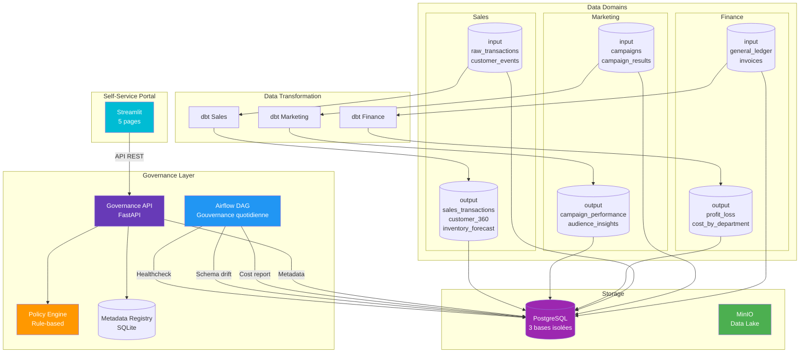

# Architecture — Data Mesh Self-Service Platform

## Flux des données

1. **Streamlit Portal** — Interface self-service pour découvrir, créer et demander des data products
2. **Governance API** — Enregistre les métadonnées, évalue les policies d'accès, trace les audits
3. **3 Domaines isolés** (Sales / Marketing / Finance) avec leur propre base PostgreSQL
4. **dbt** — Transforme les tables `input` → `output` (data products)
5. **Airflow** — Orchestre la gouvernance quotidienne (healthcheck, schema drift, coûts)
6. **Policy Engine** — Rule-based : deny by default, exceptions pour certains rôles/domaines

## Ports

| Service | Port |
|---------|------|
| PostgreSQL | 5432 |
| MinIO API | 9002 |
| MinIO Console | 9003 |
| Airflow | 8080 |
| Governance API | 8100 |
| Streamlit Portal | 8501 |
